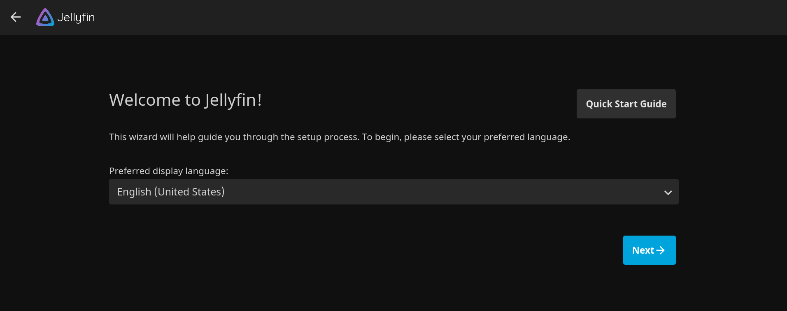
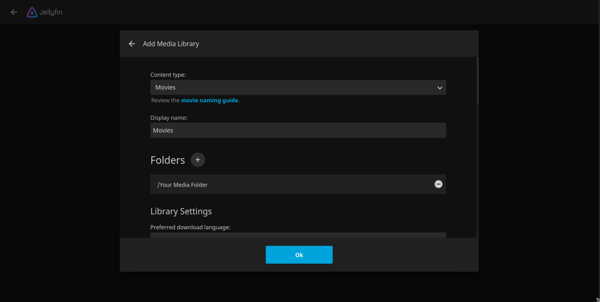
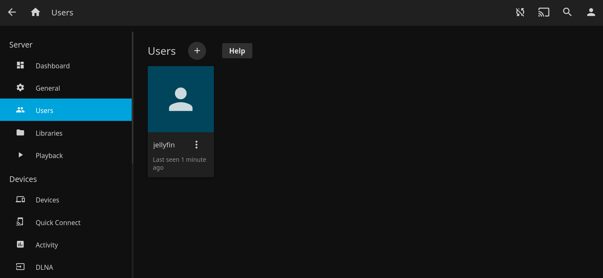

## What is Jellyfin, Sonnarr, Radarr and Jackett?

### Jellyfin 
Jellyfin is a client/server media player system. When you install a media server program on your computer, it becomes your host server. You can connect to it from your phone and stream the media that's stored on your computer's hard drive. Think of it like YouTube or Spotify, but your computer is the server and the content that is available is based on the media files on the computer. Another more known media server is Plex, but Jellyfin is a completely free and open-source alternative. The Jellyfin server is available for Linux, MacOS and Windows and I'll be using Macos for this guide, however the process will be similar for all OS's.

### Sonnarr/Raddarr/Jackett
You know how you have to manually download episodes of the shows you like? Well, these three applications will help automate that. They will automatically download new episodes as they become available, also, it can replace lower quality videos with higher quality ones once they become available. Sonarr if for series and Radarr for movies. Jackett is an app that will help Sonarr and Radarr search for different shows and movies from different trackers.

## Jellyfin configuration
Install the latest Jellyfin server from [here](https://jellyfin.org/downloads/). For Macos, remember to move the app to the Application folder. On Arch Linux, you can isntall Jellyfin from the AUR as [jellyfin-bin](https://aur.archlinux.org/packages/jellyfin-bin/) and start the service by <code>sudo systemctl enable --now  jellyfin.service</code>.

After installing Jellyfin, you should first find out your server IP. On MacOs you can find it by going to System Preferences > Network > Advanced > TCP / IP > IPv4 Address. It's usually 192.168.1.* in my case it's 192.168.1.38.

Now run Jellyfin and navigate on your browser to http://<your-server-ip>:8096. You should see an output as below: 

Choose your language and click next. In the next screen, create a user and enter a password of your choice. The next page prompts you to set media libraries. If you have already something downloaded, you can import it here. Choose the content type (i.e. audio, video, movies etc.), enter display name and click plus (+) sign next to the Folders icon to choose the location where you kept your media files. 

Afterwards, click next to all the next prompts and once you log in, you should see your media files imported before. 

If you want to change anything or reconfigure, click on the three horizontal bars from the Home screen and go to Dashboard. I would recommend adding a new user for your guests, click the add button and create a new user, you can create a new user without a password if you want.

You can access this Jellyfin media server from any systems or devices such as mobile phone, tablet or pc, on the network using URL - http://ip-address:8096. 

## Sonarr, Radarr and Jackett

